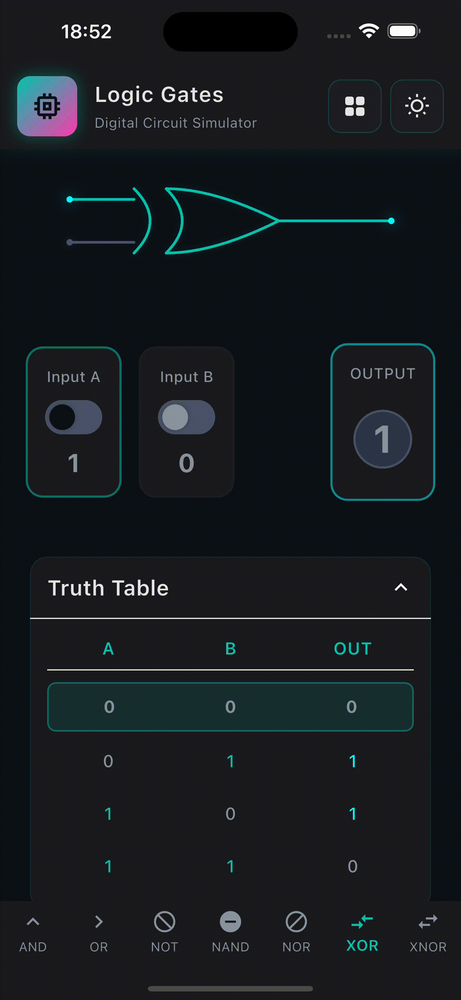

# Digital Logic Playground

A beautiful, interactive Flutter app for learning and experimenting with digital logic gates. Features smooth animations, a minimalistic design, and real-time circuit simulation.

## Demo



## Features

- **7 Logic Gates**: AND, OR, NOT, NAND, NOR, XOR, XNOR
- **Interactive Inputs**: Toggle input values with smooth animations
- **Real-time Output**: See gate outputs update instantly
- **Truth Tables**: Complete truth tables for each gate with current state highlighting
- **Gate Visualization**: Clean, minimalistic gate symbols with subtle animations
- **Modern UI**: Cyberpunk-inspired dark theme with cyan/teal accents

## Tech Stack

- **Flutter 3.35.7** - Cross-platform mobile framework
- **Dart 3.9.2** - Programming language
- **BLoC Pattern** - State management
- **Custom Painters** - Hand-drawn gate symbols
- **Material 3** - Modern design system
- **Platforms**: iOS, Android, Web, macOS (desktop enabled)

## Getting Started

### Prerequisites

- Flutter SDK 3.35.7 (stable channel)
- Dart SDK 3.9.2
- Xcode 16.4 (for iOS/macOS development)
- Android SDK 36.1.0 (for Android development)

### Installation

1. Clone the repository:

```bash
git clone https://github.com/RostislavUlinets/Digital-Logic-Playground.git
cd digital_logic_playground
```

2. Install dependencies:

```bash
flutter pub get
```

3. Run the app:

```bash
flutter run
```

## Project Structure

```
lib/
├── core/           # Theme, constants, dependency injection
├── data/           # Data sources and repositories
├── domain/         # Business logic and entities
└── presentation/   # UI components, screens, and state management
    ├── blocs/      # BLoC state management
    ├── painters/   # Custom gate painters
    ├── screens/    # Main screens
    └── widgets/    # Reusable widgets
```

## Architecture

This project follows **Clean Architecture** principles with the BLoC pattern for state management:

- **Presentation Layer**: UI components and BLoC
- **Domain Layer**: Business logic and use cases
- **Data Layer**: Repositories and data sources

## Contributing

Contributions are welcome! Please feel free to submit a Pull Request.

## License

This project is open source and available under the MIT License.

## Author

**Rostislav Ulinets**

- GitHub: [@RostislavUlinets](https://github.com/RostislavUlinets)

---

Built with ❤️ using Flutter
